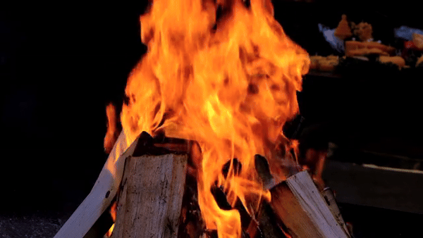
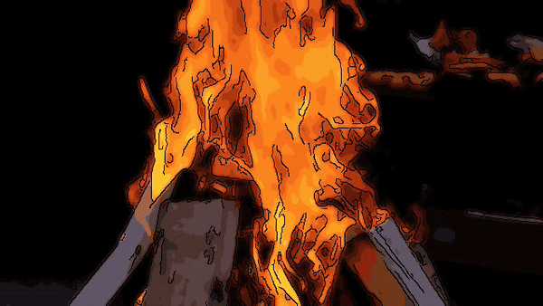
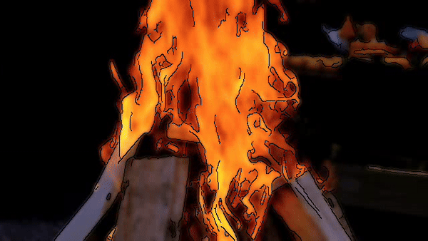

# Cartoonizer with OpenCV

This is a simple python script to convert an image to a cartoon using OpenCV. The script uses the bilateral filter and adaptive thresholding to convert the image to a cartoon. To cartoonize it, I used edge finders and KMeans to make it more cartoony. The result is a more cartoony look than if we had only used edge findings.

# Limitations

The script does not work well with images that have a lot of noise. The script works best with images that have a lot of white space. 

# Example

- Original Video
 
- Cartoonized Video
  
- Bad Example
  